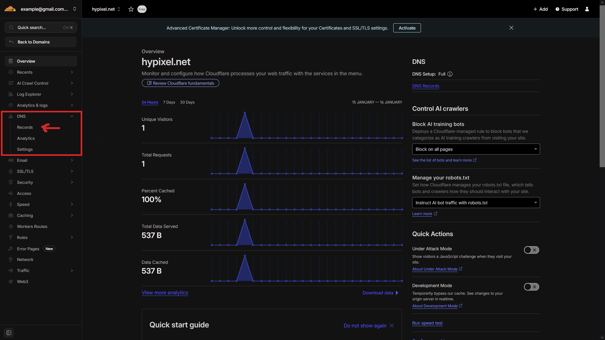

# Podłączanie domeny do serwera Minecraft



### Strefa DNS

Przejdź do zakładki **Records** w kategorii **DNS**.

<figure><figcaption></figcaption></figure>



### Tworzenie rekordu

Stwórz nowy rekord typu A

<figure><figcaption></figcaption></figure>



### Ustawianie rekordu typu A

Po utworzeniu rekordu typu **A** należy poprawnie skonfigurować jego podstawowe parametry.\
\
**Name**\
Jako nazwę rekordu zaleca się ustawić znak: `@` Lub wpisać pełną nazwę swojej domeny (np.`hypixel.net`)\
**IPv4 Address**\
W tym polu wpisz **ip numeryczne** twojego serwera. Ip znajdziesz w panelu hostingu, zazwyczaj w zakładce z konsolą serwera np. `2137.420.69.67`

<figure><figcaption></figcaption></figure>




Niektóre hostingi oferują subdomeny, w takim przypadku zalecane jest pominięcie tworzenia rekordu A. Wystarczy jedynie w rekordzie SRV w zakładce "target" ustawić twoją subdomene.


### Tworzenie i konfiguracja rekordu SRV

Kolejnym krokiem jest utworzenie nowego rekordu **SRV**, który umożliwi poprawne przekierowanie domeny na serwer Minecraft.\
\
**Name**\
Wpisz: `_minecraft._tcp` \
**Priority**\
Ustaw Wartość: `1`\
**Weight**\
Ustaw Wartość: `1` \
**Port**\
Wpisz port twojego serwera. Port znajdziesz w panelu hostingu, zazwyczaj w zakładce z konsolą serwera, obok adresu IP. np: `2137.420.69.67:25565`


&#x20;W tym przypadku portem jest `25565`


**Target**\
Wpisz nazwę rekordu A, który został utworzony wcześniej.


W moim przypadku targetem jest: `hypixel.net`&#x20;


<figure><figcaption></figcaption></figure>



### Połącz się z twoim serwerem

Jeżeli wykonałeś wszystko poprawnie powinieneś móc połączyć się już z twoim serwerem.


Czasami podpięcie domeny może zająć dłuższy okres czasu (czasem nawet 48 godzin w najgorszych przypadkach). Jeżeli odrazu nie będziesz mógł się połączyć z serwerem nie panikuj, odczekaj chwile.



