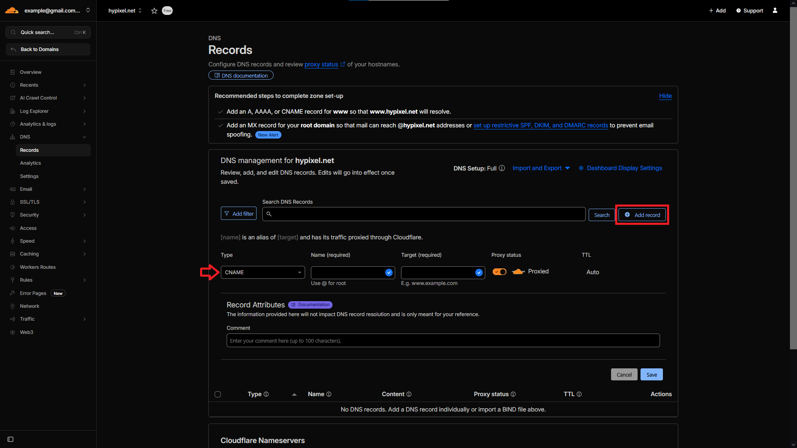

# Gdy posiadasz serwer zarządzany z dedykowanym ip



### STREFA DNS

Przejdź do zakładki **Records** w kategorii **DNS**.

<figure><figcaption></figcaption></figure>



### Tworzenie rekordu

Stwórz nowy rekord typu **CNAME**

<figure><figcaption></figcaption></figure>



### Ustawianie rekordu typu CNAME

Po utworzeniu rekordu typu **CNAME** należy poprawnie skonfigurować jego parametry.\
\
**Name**\
Jako nazwę rekordu zaleca się ustawić znak: `@` Lub wpisać pełną nazwę swojej domeny (np.`hypixel.net`)


W moim przypadku name to jest `hypixel.net`


**Target**\
W tym polu wpisz **ip** twojego serwera. Ip znajdziesz w panelu hostingu, zazwyczaj w zakładce z konsolą serwera np. `pl06.icehost.pl`


W moim przypadku targetem jest: `pl06.icehost.pl`&#x20;


<figure><figcaption></figcaption></figure>



### Połącz się z twoim serwerem

Jeżeli wykonałeś wszystko poprawnie powinieneś móc połączyć się już z twoim serwerem.


Pamiętaj, że wymagane przy rekordzie typu CNAME jest to, żeby serwer miał domyślnie ustawiony port 25565, w innym wypadku nie uda ci się połączyć z serwerem.\
Przykładami hostingów na których otrzymujesz dedykowany adres ip są: [https://bloom.host/](https://bloom.host/) czy [https://pufferfish.host/](https://pufferfish.host/)



Czasami podpięcie domeny może zająć dłuższy okres czasu (czasem nawet 48 godzin w najgorszych przypadkach). Jeżeli odrazu nie będziesz mógł się połączyć z serwerem nie panikuj, odczekaj chwile.




