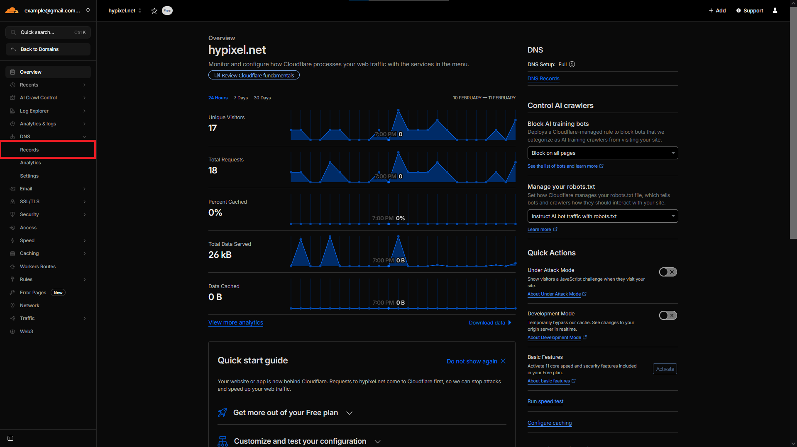
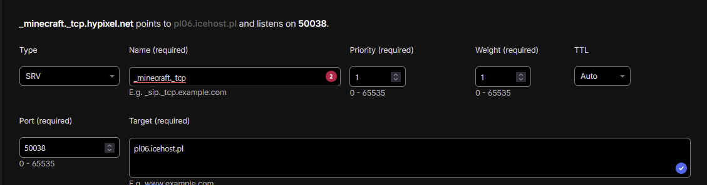

# Gdy posiadasz VPS/DEDYKA



### Strefa DNS

Przejdź do zakładki **Records** w kategorii **DNS**.

<figure><figcaption></figcaption></figure>



### Tworzenie rekordu

Stwórz nowy rekord typu A

<figure><figcaption></figcaption></figure>



### Ustawianie rekordu typu A

Po utworzeniu rekordu typu **A** należy poprawnie skonfigurować jego parametry.\
\
**Name**\
Jako nazwę rekordu zaleca się ustawić znak: `@` Lub wpisać pełną nazwę swojej domeny (np.`hypixel.net`)\
**IPv4 Address**\
W tym polu wpisz **ip numeryczne** twojego serwera. Ip znajdziesz w panelu hostingu, zazwyczaj w zakładce z konsolą serwera np. `2137.420.69.67`

<figure><figcaption></figcaption></figure>



### Połącz się z twoim serwerem

Jeżeli wykonałeś wszystko poprawnie powinieneś móc połączyć się już z twoim serwerem.


Pamiętaj, że wymagane przy rekordzie typu A jest to, żeby serwer miał domyślnie ustawiony port 25565, w innym wypadku nie uda ci się połączyć z serwerem.



Czasami podpięcie domeny może zająć dłuższy okres czasu (czasem nawet 48 godzin w najgorszych przypadkach). Jeżeli odrazu nie będziesz mógł się połączyć z serwerem nie panikuj, odczekaj chwile.



